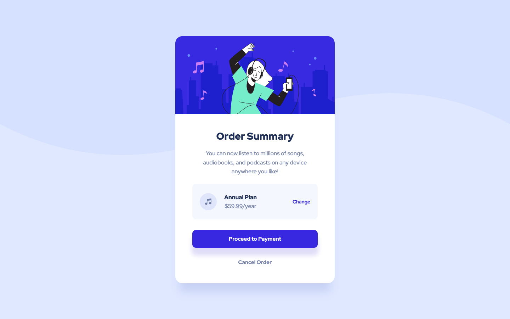

# Frontend Mentor - Order summary card solution

This is a solution to the [Order summary card challenge on Frontend Mentor](https://www.frontendmentor.io/challenges/order-summary-component-QlPmajDUj). Frontend Mentor challenges help you improve your coding skills by building realistic projects.

## Table of contents

- [Overview](#overview)
  - [The challenge](#the-challenge)
  - [Screenshot](#screenshot)
  - [Links](#links)
- [My process](#my-process)
  - [Built with](#built-with)
  - [What I learned](#what-i-learned)
  - [Useful resources](#useful-resources)
- [Author](#author)

## Overview

### The challenge

Users should be able to:

- See hover states for interactive elements

### Screenshot

- Mobile View

  

- Desktop View

  

### Links

- Solution URL: [Github](https://github.com/asdiAdi/order-summary-component)
- Live Site URL: [Vercel](https://order-summary-component-navy-seven.vercel.app/)

## My process

### Built with

- Semantic HTML5 markup
- CSS custom properties
- Flexbox
- Responsive Web design
- Mobile-first workflow

### What I learned

Transition & Text Decoration

```css
.sample {
  border-bottom: 1px solid blue;
  transition: 0.3s;
}
.sample :hover {
  border-color: red;
}
```

## Author

- LinkedIn - [@asdiAdi](https://www.linkedin.com/in/asdiAdi/)
- Github - [@asdiAdi](https://github.com/asdiAdi)
- Frontend Mentor - [@asdiAdi](https://www.frontendmentor.io/profile/asdiAdi)
- Freecodecamp = [@asdiAdi](https://www.freecodecamp.org/asdiAdi)
